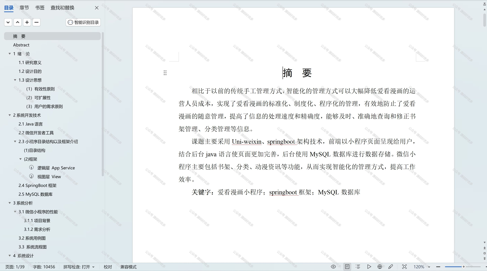

 
## 查看主页获取源码

> **作者介绍**： **✌**全网粉丝10W+本平台特邀作者、博客专家、CSDN新星计划导师、java领域优质创作者,博客之星、掘金/华为云/阿里云/InfoQ等平台优质作者、专注于项目实战 **✌**

  

### 一、作品包含

源码+数据库+设计文档万字+PPT+全套环境和工具资源+部署教程

### 二、项目技术

前端技术：Html、Css、Js、Vue、Element-ui

数据库：MySQL

后端技术：Java、Spring Boot、MyBatis

  

### 三、运行环境

开发工具：IDEA/eclipse + 微信开发者工具

数据库：MySQL5.7

数据库管理工具：Navicat10以上版本

环境配置软件： JDK1.8+Maven3.6.3

前端Nodejs：14

### 四、项目介绍
项目编号：mpweixinA011

"爱看漫画"微信小程序，以便更好地维护漫画资源，监控用户行为，优化用户体验，并推动漫画文化的传播。通过这一系统，我们能够确保小程序内容的丰富多样，同时精准把握市场动态，为漫画爱好者提供更加贴心和专业的服务。

前台用户功能：首页、书架、分类、动漫资讯、会员购买、在线客服。

后台管理员的功能：系统首页、个人中心、用户管理、书架管理、分类管理和系统管理。

### 五、运行截图

  
